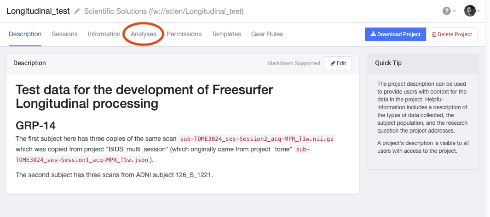
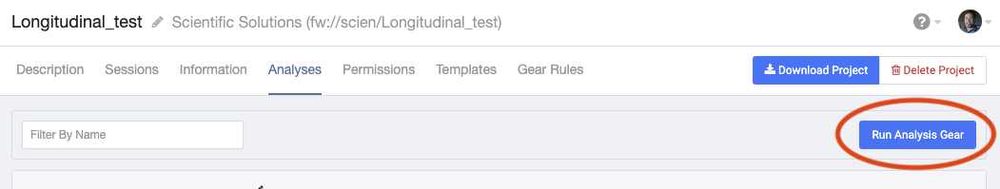

# GRP-14b FreeSurfer Longitudinal Analysis Aggregation

## Overview
GRP-14b aggregates the results of gear [GRP-14](https://github.com/flywheel-apps/GRP-14/tree/master), which runs the [FreeSurfer Longitudinal Analysis Pipeline](https://surfer.nmr.mgh.harvard.edu/fswiki/LongitudinalProcessing) (version 6.0.1-5).

The current FreeSurfer version is based on: freesurfer-Linux-centos6_x86_64-stable-pub-v6.0.1.tar.gz.

## Gear Execution
This gear needs to be run at the project level.  To do this, after selecting a project, click on the "Analyses" tab:


Then click on the "Run Analysis Gear" button:


This gear searches through all analyses created by GRP-14 and combines their
.csv files.

### INPUTS
No gear inputs are required.

### CONFIG

`analysis-regex`: [_Optional_] A regular expression to find analyses to include. The default is to find all analyses for the given gear and version.  Example: To find analysis.label "grp-14 01/06/2020 11:14:05", use `.*\\/2020 .*`. It will find all analyses where the name includes a slash followed by the year 2020 and a space after it.

`gear-log-level`: [_Default=INFO_] Gear Log verbosity level (ERROR|WARNING|INFO|DEBUG).

`name-of-gear`: [_Default=grp-14_] The name of the gear to find analyses where the results should be consolidated.

`version-of-gear`: [_Optional_] Similar to `name-of-gear`.  The default is to find all versions.


### OUTPUTS
The following summary outputs are created:
```
PROJECT.LABEL_aseg_vol.csv
PROJECT.LABEL_aparc_vol_right.csv
PROJECT.LABEL_aparc_vol_left.csv
PROJECT.LABEL_aparc_thick_right.csv
PROJECT.LABEL_aparc_thick_left.csv
PROJECT.LABEL_aparc_area_right.csv
PROJECT.LABEL_aparc_area_left.csv
```
Where "PROJECT.LABEL" is replaced with the Flywheel Project label.
